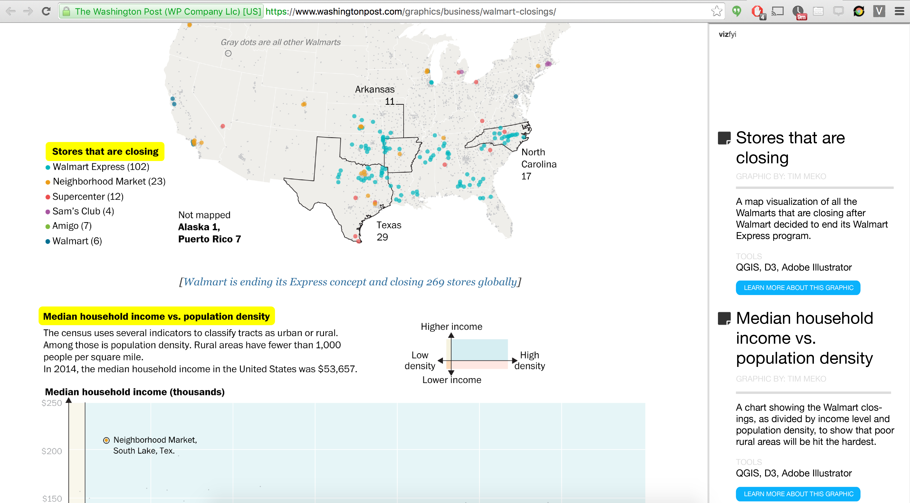

# V3 Chrome Extension

### Team Embarcadero - SND Makes SF

Team members:
- [Robert Simmon](https://twitter.com/rsimmon)
- [Allison McCartney](https://twitter.com/anmccartney)
- [Jessica Soberman](https://twitter.com/sobermanj)
- [David Leonard](https://twitter.com/davidleonardii)

To get extension working on your computer

1. Clone down this repo
2. Go to chrome://extensions/ in your browser
3. Hit 'Load unpacked extension'
4. Navigate to and select the project folder

To use this extension

1. Navigate to any news story with a graphic
2. Highlight the title/caption for a graphic
3. Click the pen icon in the top right corner
4. Fill out the form and submit

#### Submissions are logged [here.](http://v3-api.herokuapp.com/)

To view the code of the inner workings of the app, go to the [API/app repo.](https://github.com/davidrleonard/v3-api)

In the future, this will include a 'view annotations' feature that will look something like

 **If you would like to help us make this happen, please contact one of us via the Twitter dot com!**

---

# Documentation

- Introduction
- Goal of Open Trails
- Primary Use Case
- Design Considerations and Assumptions
- An Overview of the Document Form & Data
- Future Versions
 
### Introduction

Visualization Verification View (V³) aims to serve as a "view source" for data-visualizations. By guiding authors (journalists, developers, designers, and researchers) to document their workflow and design process, and allowing readers to see this process when reading the published product, this tool aims to add value through: helping the information design and news design community build a database of knowledge around the techniques and decisions made when building data visualizations, preserve and grow organizational knowledge through providing a standard for best practices in documentation, and enable additional reporting through this documentation.

### The Goals of Visualization Verification View (V³) 

The development, promotion and adoption of this specification is being pursued to advance a specific set of goals related to building a way for news designers to document their visualization building process and interested readers to learn from that documentation as part of a broader goal to grow the news and information design community:

- Improve citizen access to information presented in data-driven stories

- Facilitate data sharing 

- Encourage and support the continued development of data and design capacities among interested parties

- Build open-data habits around data visualizations

- Enable third-parties of all kinds to access and use accurate information around existing data visualizations 

- Build a database of existing data visualizations

- Preserve and grow organizational knowledge through providing a standard for best practices in documentation

- Enable additional reporting through this documentation..

### The Primary Use Case

There's no easy way for information and news designers to "show their work" around a data visualization, but it is necessary for internal knowledge management and transfer within companies, between communities, and to help other reporters continue to report on the story. Because there currently no way to understand how a data visualization in a news story was created, from either an editorial, design or technical perspective, short of knowing the authors (and even then) there would be no way to learn from the existing body of work. Visualization Verification View is a tool that allows an author to follow an outline for documentation that can then be published and shared with story readers who want to know more about the visualization. 

The development of Visualization Verification View (V³) is a product of  SNDMakes-SF, an event held by The Society for News Design in partnership with Code For America, and event hosts CodePen, InVision App, Planet Labs, Medill School and the Northwestern University Knight Lab, and part of the broader SNDMakes-program with support from ​Knight Foundation, and their scholarship funders: ​Dow Jones News Fund​, ​Scripps Howard Foundation, and ​Excellence in Ethics and Journalism Foundation.

### Design Considerations and Assumptions 

Use of a Google Plug-in and why:

Balance of tagging and open-ended questions : We wanted to give users enough guidelines to help them understand what each of the field’s we chose meant. However, we wanted to leave room for users to express more detailed information about their thought process as they see necessary. The benefit of the tagging system is that this information could eventually be leveraged in aggregate. We image users sticking to a taxonomy as rigorous as they see fit, while encouraging users to get as specific as possible. For example, creating field for a type of map, rather than letting #map suffice as a stand alone tag. 

### An Overview of the Document Form & Data

[Visualization Verification View - Form Structure](https://docs.google.com/spreadsheets/d/1PEoMEZo_ZsM0Iv0urW1vD9lFCFa1HNYn6JF_uXIr7X4/edit?pref=2&pli=1#gid=1239585791)

### Future Versions

The current specifications were built within a 72 hour period. We have envisioned possible next steps. This working document will continue to serve as a forum for discussion and feedback to inform the future evolution of the specification.

Possible Next Steps:
Build the experience for viewing the form as a reader of the data visualization - the “view source” experience. 